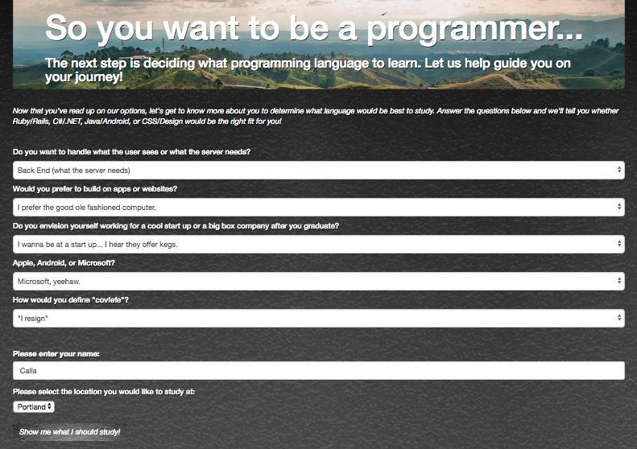

# Track Selector

#### _Second Independent Project (JS) for Intro at Epicodus, 06.02.2017_

#### By _**Calla Rudolph [(e-mail)](<callarudolph@gmail.com>)**_

## Description

_This was my first JavaScript Independent Project after just one week of practice work! This was a mock survey for a user to make selections which would then define the best programming language for him to study. It includes input forms and select boxes. The inputs are then submitted into JavaScript and assigned variables. Branching is then used within JavaScript to define, or "show", a hidden answer div id within HTML, which is specific to a formula for the input variables that were selected by the user._

## Setup/Installation Requirements

* _Open GitHub site on your browser: https://github.com/CallaRudolph/introweek2_
* _Select the dropdown (green box) "Clone or download"_
* _Copy the link for the GitHub repository_
* _Open Terminal on your computer and perform the following steps:_
  * _`$ cd desktop`_
  * _`$ git clone <paste-repo-url>`_
  * _`$ cd introweek2`_
  * _`$ open index.html`_
* _Try several options when filling out the survey to view various Track results!_

## Technologies used

HTML, CSS, Bootstrap, JavaScript, and jQuery.

## Support and contact details

_If you run into any findings, please email me at the address above!_

### License

_This software is licensed under the MIT license._

**Copyright (c) 2017 Calla Rudolph**
